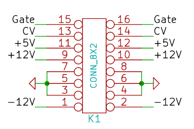

Good Intro:

- https://aisynthesis.com/how-to-get-started-in-synth-diy/
- https://www.schmitzbits.de/index.html
- http://www5b.biglobe.ne.jp/~houshu/synth/

# Format

Eurorack is super popular

https://en.wikipedia.org/wiki/Eurorack

- 3.5" mono patch cables
- 3U, 1HP
- 10 or 16-pin ribbon power - +/-12V, sometimes 5V digital
- Audio signals are typically a maximum of 10V peak-to-peak (i.e. between -5V and +5V)
- Control voltages can either be unipolar or bipolar. Bipolar control voltages are typically 5V peak-to-peak (i.e. from -2.5V to +2.5V), unipolar voltages between 0V and 8V. The V/Octave scale is used for pitch information
- Trigger, Gate or Clock signals are digital 0V-5V pulses typically used for timing and event signalling
- 100K input impedance [typical](https://learningmodular.com/glossary/impedance/)

[Pinout](http://www.davidhaillant.com/wp/wp-content/uploads/bus_eurorack1.pdf):

# Case:

LACKRack is a cheap Ikea way to create a rack.

https://wiki.eth0.nl/index.php/LackRack

TipTop is good starter product, has it has adapter for mounting modules in 19" rack, and included power supply

- https://www.sweetwater.com/store/detail/HappyEndSV--tiptop-audio-happy-ending-kit-silver
- https://www.amazon.com/Tiptop-Audio-Happy-Ending-Kit/dp/B074B29GPR

# Minimum:

- MIDI-CV converter
  - digital MIDI input to OSC CV
  - Multiple voice output
- Oscillators
  - Eventually 3-voice, 1 for now
  - Square/Saw good enough for now
  - LM13700?
  - LFO:
    - 555 or relaxation
    - CV and digital out
- Filters
  - Moog 4P-Ladder LP
  - 2nd Order simple switchable LP/HP(/BP?)
- Amplifier
  - 2 input mixer with final output control
  - choice between seprate stereo and mixed?
  - Built-in headphone driver

# Amplifier

Features:
- 2 independently-voltage-controlled inputs, mixed down to master control with choice between pot and CV control
- Multiple input ports to same channel (allowing mixing different sources)
- Main out (1/4") plus embedded headphone amplifier and stereo headphone jack

Calculations: https://docs.google.com/spreadsheets/d/1fOI5-cV5lOYskNise5XZh0knm-L3UJJyRrtGQZKEftU/edit#gid=1448634371

- https://www.onsemi.com/pub/Collateral/2N5457-D.PDF
- http://www.ti.com/lit/ds/symlink/lm386.pdf
- https://www.schmitzbits.de/vca.html#
- http://www.ecircuitcenter.com/Circuits/BJT_Diffamp1/BJT_Diffamp1.htm

# TODO

- [ ] PoC amp
- [ ] PCB for complete amplifier
- [ ] PoC osc
- [ ] PoC waveshaper
- [ ] Osc sync
  - Zero-cross detector shorts fet to ground?
- [ ] tiny Breakout pcbs for headphone jacks
- [ ] PCB for oscilator
- [ ] PoC for LFO
- [ ] PoC for VCF
