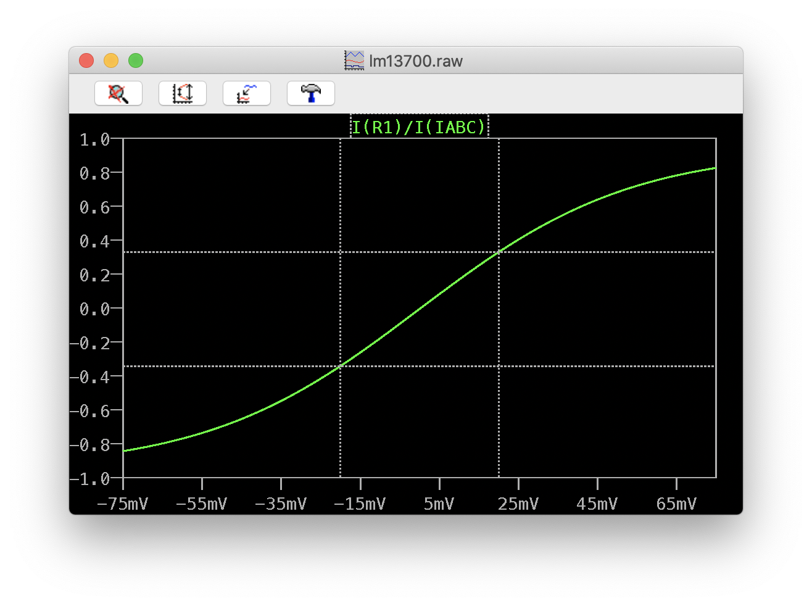
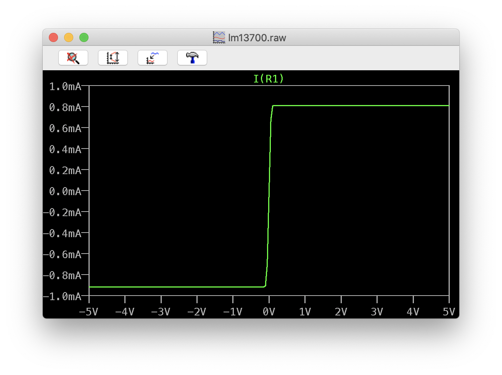
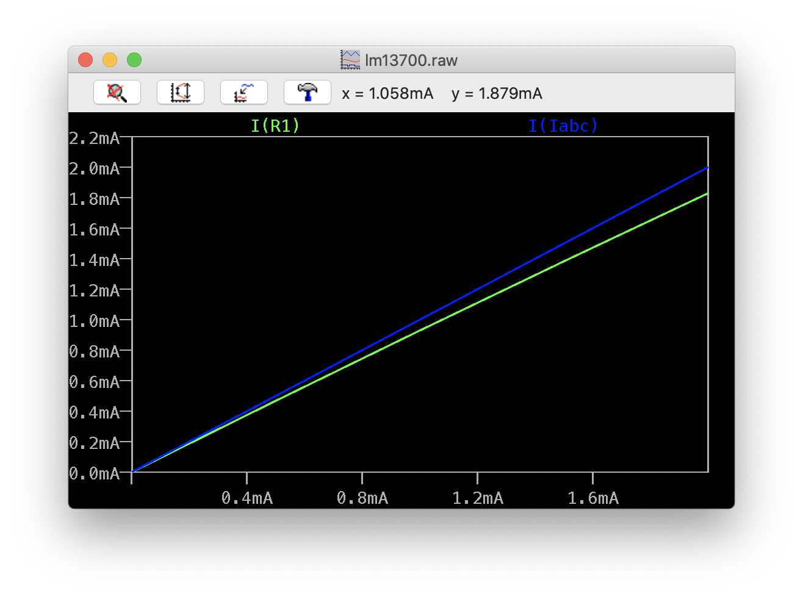
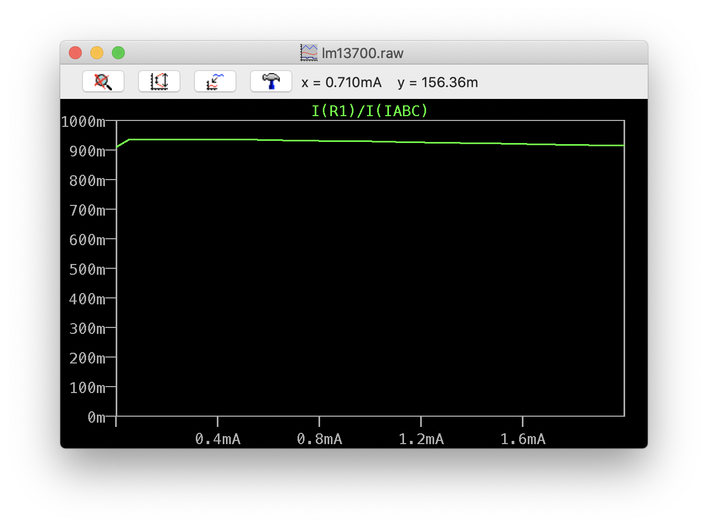
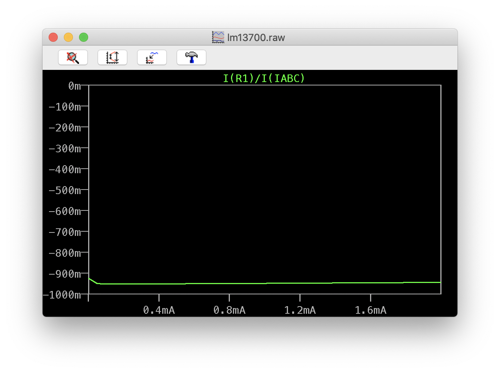

# LM13700 Behavior

## Linear region

Linear region is +/- 20mV.

    V_in / (2 * V_t) * I_abc = I_out

Peak output in the linear region if `I_abc=2mA` is then

    20mV/26mV/2*2mA = 769 uA

`V_t` is `kT/q`, 26mV at room temperature. Note: that means the transfer function has a temperature dependance. Supposedly linearizing diodes remove temperature dependance, and expands linear region to +/- 60mV.

## Outside linear region

    sign(V_in) * .95 * I_abc = I_out

The direction of the differential voltage sets the direction of `I_out`. The magnitude of `I_out` is about 91-95% of `I_abc`, the exact value varies with `I_abc`. Note that it isn't symmetrical - at 1mA it's typically 94.9% in the negative direction and 92.9% in the positive direction.

