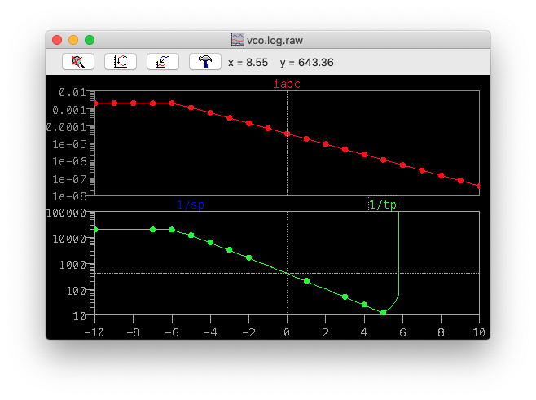
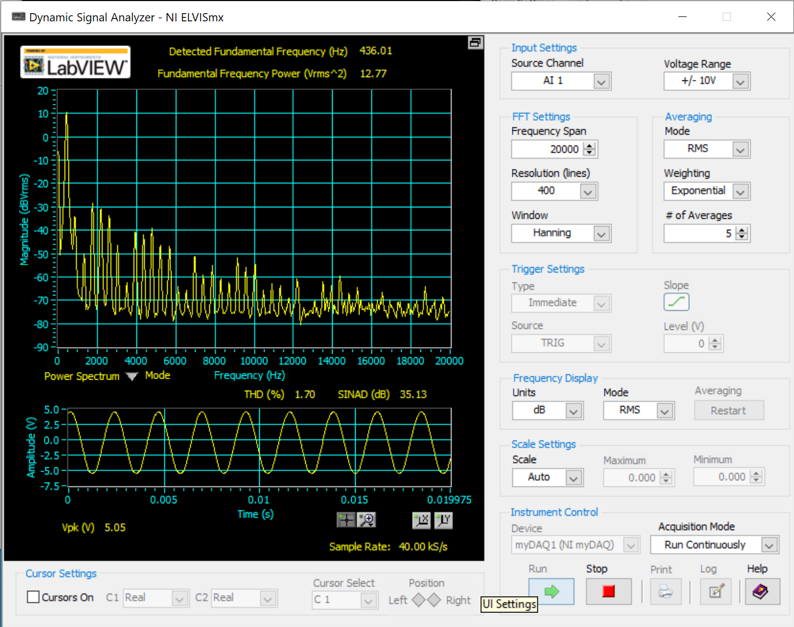

Here, the frequency measurement flies off to infinity after 5V that's because the frequency has gotten too low to fit in the `.tran` time window. Increasing the time window wide enough to measure the frequency up to CV=10V causes the simulation to timeout. However, the exp. converter remains accurate to 3 decades below 0V, which is hypothetically CV=20V -> A-16 (f=419mHz or a period of \~40 seconds). The power supply max at CV=12 would be A-8 for a period of 9.8s.

`R_ref` was calculated to be 341K but empirically determined from LTSpice model to be 326K. A trim pot should allow precision tuning.

Accuracy seems to be dependant on min/max opamp output voltages. Might be good to invest in a real rail-to-rail comparator or use offset-null of TL071.

High-freq error seems to be from comparator slew rate. TL07X slew rate is roughly 13V/us (under best circumstances). At 14.08KHz, the period is \~71us, and it's got to travel 8.2V in two directions. That means 1.8% error right there.

From the simulation, the slew rate at 14.08KHz seems to be 3.8V/us, for an error of 6.2%, which is a bit closer to the measured 14%.

The LM311 datasheet claims a slew rate of up to 50V/us, equating to a \~0.5% error.

## Shapes

### Triangle

Triangle wave comes from the square/triangle core.

### Square

A base square wave comes from the square/triangle core. We feed that into a comparator which gives control over PWM.

### Sine

Triangle wave is converted to a sine wave using a textbook transistor waveshaper. The THD is on the order of 1-2%.

### TODO: shape #4

Sub/super octave???

## Tuning

1. Set CV to 5V and adjust input network so VB=0V
2. Adjust square voltage divider network to 5V output and 0 offset
3. Adjust IREF to get 440Hz frequency
4. Set CV to 6V and adjust CV scale ratio to get 880Hz frequency
5. Adjust waveshaper current source pot until symmetric
6. Adjust waveshaper input voltage divider to minimize THD
7. Adjust waveshaper output stage to set level
